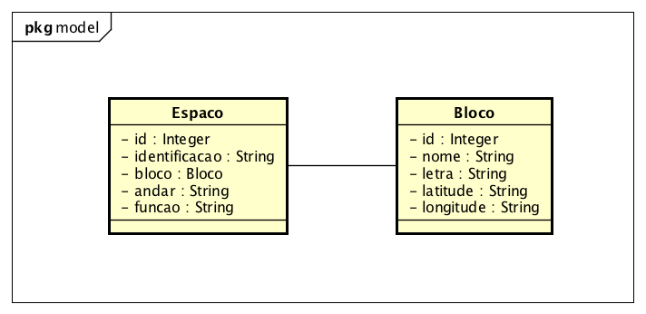
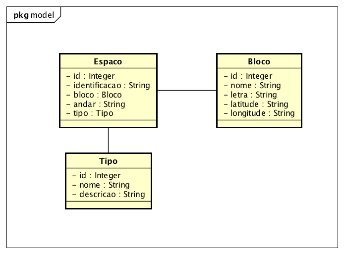
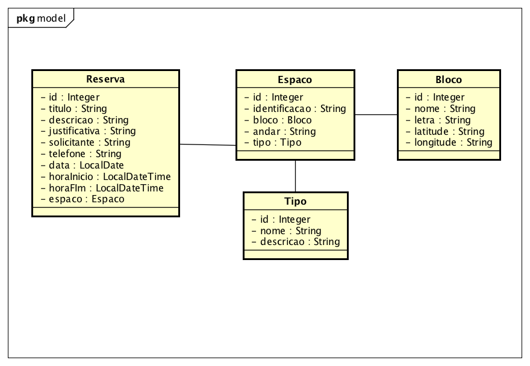

# GEU - GERENCIADOR DE ESPAÇOS UNIVERSITÁRIOS

## VERSÃO AVALIAÇÃO:

O código apresenta apenas o conteúdo visto na AVI:
* HTML
* CSS
* JavaScript
* Java
* JavaScript
* JSP
* JDBC

O projeto esta no Eclipse e esta usando o banco de dados HSQLDB em memória. Não há nenhuma necessidade de alterar a classe __Conexao.java__

* 'Caso deseje altera é por sua conta e risco.'

Para atender aos requisitos de mapeamento de espaços da universidade a primeira versão foi desenvolvida com base no diagrama de classes.

Evoluímos de acordo com a demanda para um segundo diagrama de classes.

Atualmente o sistema está executando, inserindo e listando Espaços, Blocos e Tipos.

## ALTERAÇÕES NECESSÁRIAS

Agora que o usuário já pode cadastrar os espaços ele gostaria de fazer uma reserva para uma determinada data e também consultar as reservas.

Estude o código existente e adicione a funcionalidade ligadas a Reservar um Espaço.
Crie então um novo menu Reserva com as opções de nova e listar.

O formulário de reserva deve ter:
ESPACO (ESPACO_ID)
TITULO DA RESERVA (TITULO)
DESCRIÇÃO DA RESERVA (DESCRICAO)
JUSTIFICATIVA DA RESERVA (JUSTIFICATIVA)
SOLICITANTE DA RESERVA (SOLICITANTE)
TELEFONE DE CONTATO DO SOLICITANTE (TELEFONE)
DATA DA RESERVA (DATA)
HORA DE INICIO (HORA_INICIO)
HORA DE FIM (HORA_FIM)

Uma restrição:
* Não permita que sejam criadas 2 reservas para o mesmo dia do mesmo espaço.
[ ] CRIE O FORMULÁRIO (JSP)
[ ] CRIE A LISTA (JSP)
[ ] CRIE O DAO DE RESERVA (JAVA)
[ ] EDITE O DAO DE ESPAÇO (JAVA)
[ ] CRIE O CONTROLLER DE RESERVA (JAVA)
[ ] IMPLEMENTE A RESTRIÇÃO (JAVA)

Para usar o novo esquema do banco basta remover as marcas de comentário da VERSAO 3 e comentar ou apagar os outros trechos.
